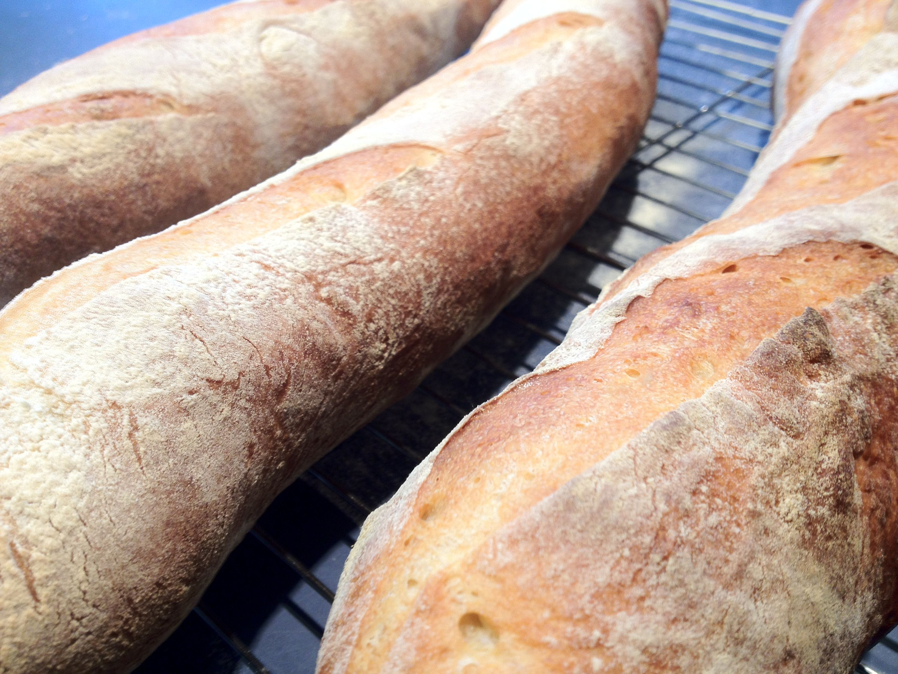
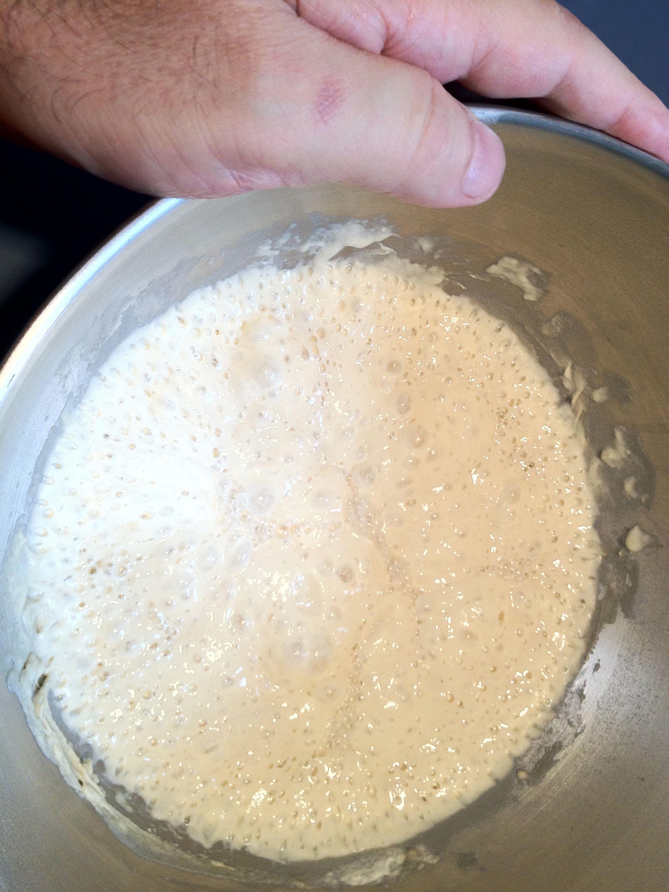
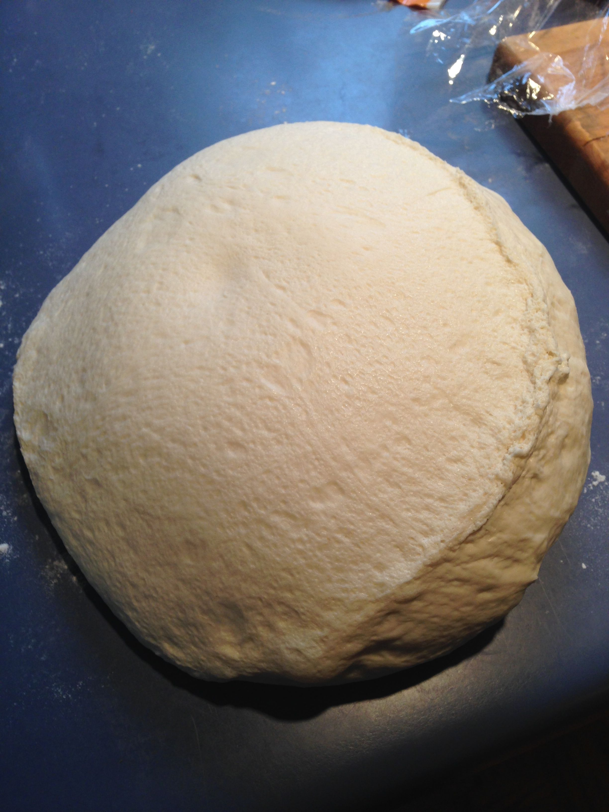
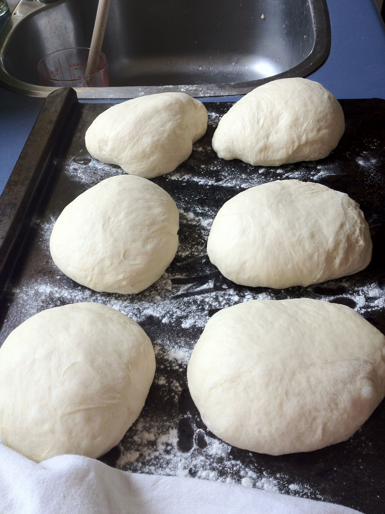
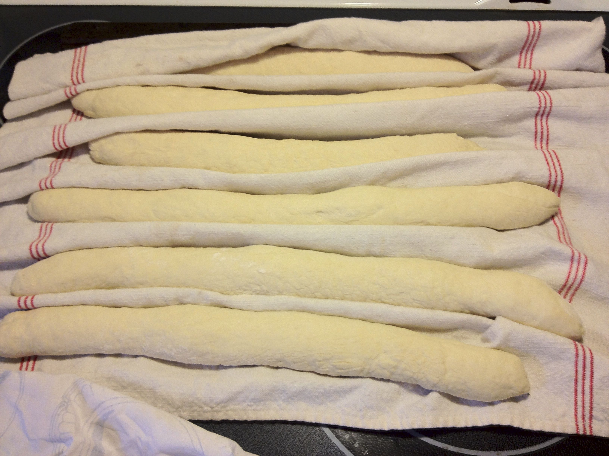
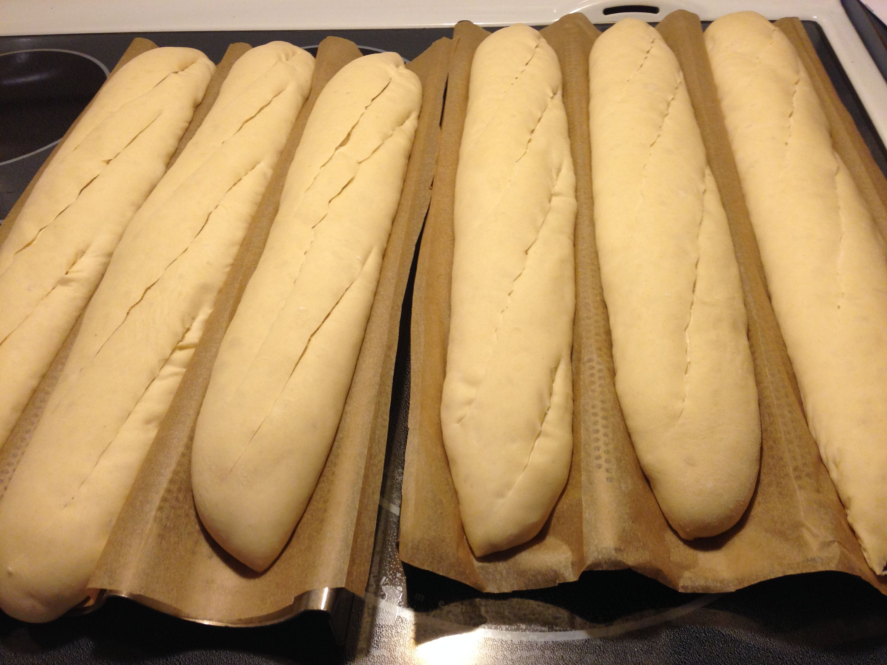

# Baguettes

Hydration: 64% (par exemple: 1,000g farine = 640 g eau)

## Ingrédients
* 1 kg de farine
* 640 g d'eau
* 20 g sel
* 12 g de levure sèche

## Préparation

1. Pré-ferment (= Poolish):
300 g eau,
300 g farine,
6 g levure sèche,
couvrir, laisser reposer 6 à 12h, temp. 23-25C

2. Frasage:
Poolish +
340 g eau,
700 g farine,
20 g sel,
5 g levure sèche
       Alternative (sans préfermentation): 1,000g farine = 650 g eau + 10 g levure
3 min frasage vitesse 1

3. Pétrissage:
4 min pétrissage vitesse 2 (ou 12 min à la main)
température cible=25C

4. Pointage  (2ème fermentation)
2 heures à 25 C, couvert
Rabattre 1 ou 2 fois (aprés 20 minutes, et 60 minutes)

5. Boulage:
Dégazer. Diviser en pâtons, faire des boules allongées

6. Détente:
20 min couvert  

7. Façonnage: 
Faire des baguettes (voir youtube videos)

8. Apprêt (= 3ième fermentation):
40 min a 1h30 couvert, t=18C min
Mettre le four à chauffer 550F = 260C;
1 tasse eau dans une lèche-frite

9. Grigne:
avec un couteau très affuté, ou mieux: une lame de rasoir

10. Cuisson: 26 min. Démarrer à 550F; vapeur+
Baisser  temp. 475F après 6 min

11. Resuage:
Sur une grille.
25 min