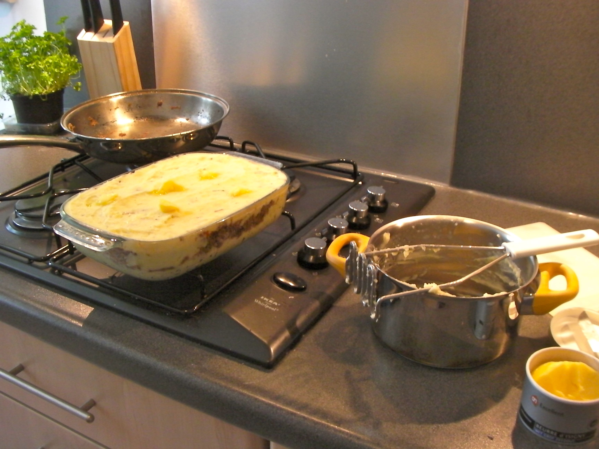

#Parmentier de confit de canard
See separate recipe for the confit de carnard = duck confit  

##Ingredients
* 5 legs of duck confit
* 5 potatoes
* milk
* butter
* egg yolk
* 6 shallots

##Preparation
1. Mashed potatoes:
   * peel potatoes, cut in small pieces, rinse in cold water
   * boil until tender (20 min)
   * drain
   * mash delicately  (if you are violent, like use a blender, it becomes a sticky mess)
   * add milk, butter, and egg yolk
   * salt, pepper, nutmeg (easy on the salt, as the confit is very salty)
2. Shredded confit:
   * from the duck confit:
   * peel off the skin, fat (if any left) etc.
   * scrape meat off the bones with fingers and/or a fork, shred the meat
   * cut shallots in very tiny pieces, one garlic clove.
   * in a frying pan:put 2 spoonful of duck fat
    make shallots melt slowly in fat
   * add a little of white wine to avoid shallots to burn
   * add thyme, pepper, maybe a touch of cognac.
   * Add the shredded duck meat, fry rapidly (you may add coriander = flat leave parsley)
3. Assemble in an oven dish ...
   * Traditional is 3 layers. 
   * Some do 2, meat at bottom.
   * you can try the 5 layers approach, if the dish is deep
   * Topping: 
   		* grated emmenthal (does not go well with confit, I think)
     	* or hazelnut crumble (crushed hazelnut, flour and butter)
     	* or breadcrumbs and butter
     	* but I favour the shallot fondue (chopped shallots, cooked slowly very long, until a little brown, use white wine to avoid burning; a dash of cognac...)
   * pass in the oven under the grill for browning the topping.

###Notes
Here is a richer version:
[http://www.aftouch-cuisine.com/recipe/parmentier-with-duck,-foie-gras-and-truffles-338.htm](http://www.aftouch-cuisine.com/recipe/parmentier-with-duck,-foie-gras-and-truffles-338.htm)

In this video, the guy mixes celery root with potatoes...
[http://blog.cuisine-et-dependances.com/parmentier-of-confit-duck/](http://blog.cuisine-et-dependances.com/parmentier-of-confit-duck/)
But you see well the shredding of the duck. And the mashing. He uses the shallots fondue as topping.

In this recipe you'll learn why it is called parmentier (and who Parmentier was).
[http://www.bonjourparis.com/story/parmentier-de-canard/](http://www.bonjourparis.com/story/parmentier-de-canard/)