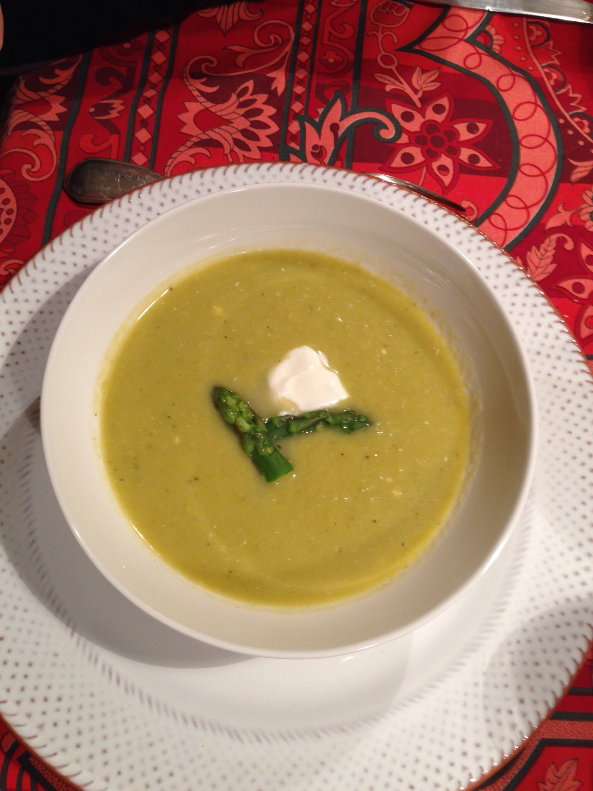
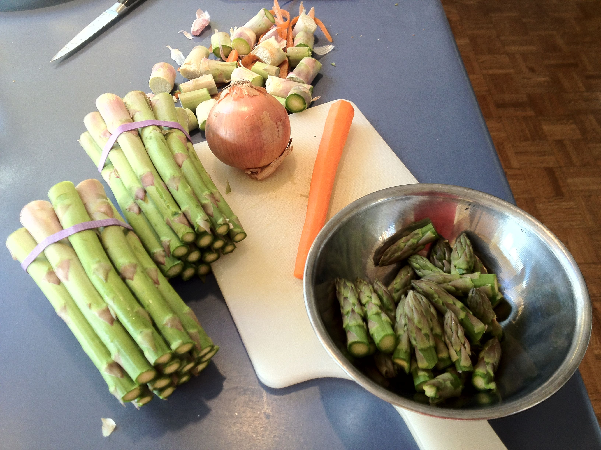
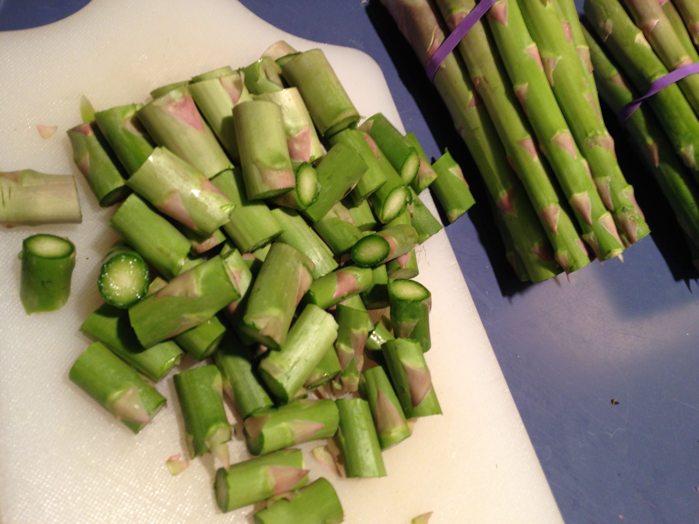
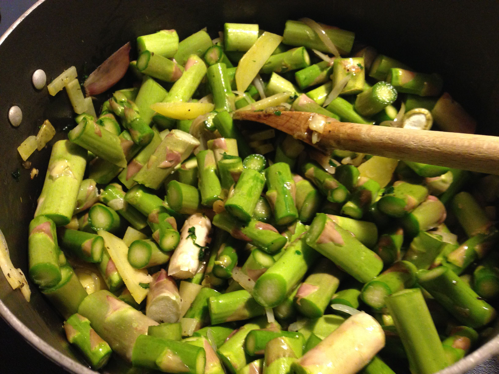
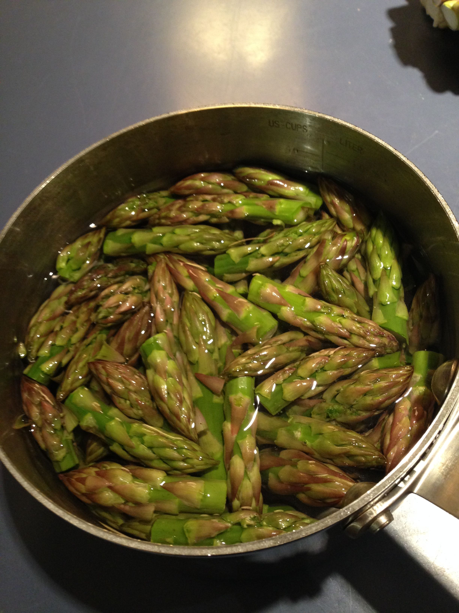

# Soupe d'Asperges

## Ingrédients

* 1 botte d'asperges
* 1 oignon
* 1 gousse d'ail
* bouillon (poule ou légume)
* thym
* 1 carotte (optionel.)
* citron (opt.)
* Crême 
* Cognac (opt.)

## Préparation
1. Emincer oignon et ail
* Faire revenir dans de l'huile (d'olive)
* Séparer les têtes d'asperges
* Couper le reste en petits segments  

* Ajouter les segments dans la casserole  

* Recouvrir de bouillon
* Mettre un peu de jus de citron et du cognac
* Passer au mixer très fin, avec de la crême
* Ebouillanter les têtes  

* Servir avec les têtes et de la crême pour décorer

